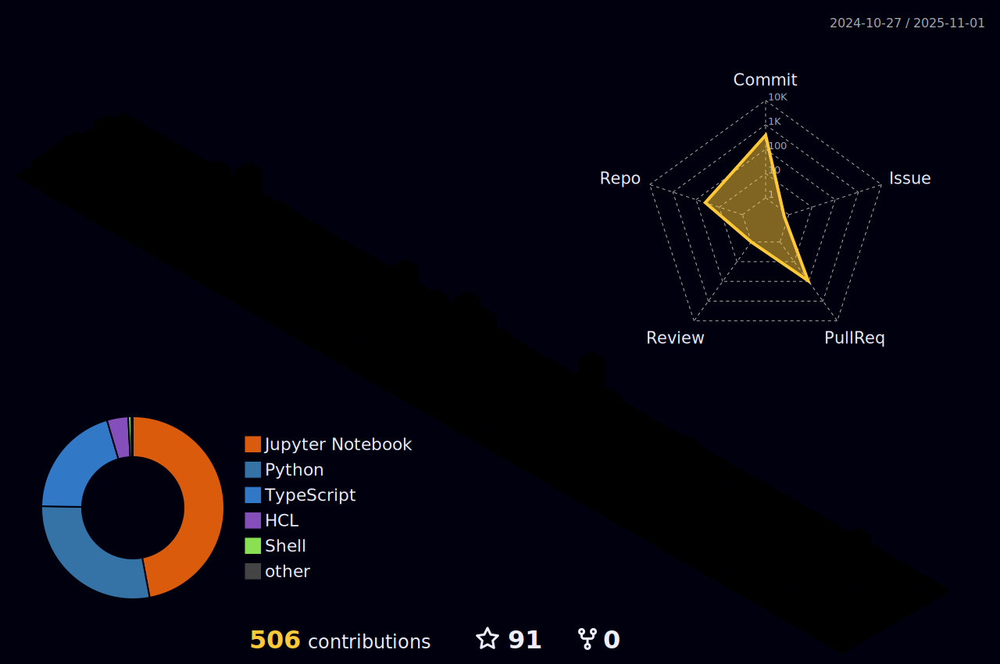

<table>
  <tr>
    <th colspan = "2" style="box-shadow: 0 4px 8px rgba(0, 0, 0, 0.2), 0 6px 20px rgba(0, 0, 0, 0.19); border-radius: 10px; overflow: hidden;">
      
    </th>
  </tr>
  <tr>
    <!-- Left Column: Skillsets Image -->
    <td style="width: 70%; text-align: center; vertical-align: top;">
      
    </td>
    <!-- Right Column: SVG Animation --> 
    <td style="width: 30%; text-align: center; vertical-align: top;">
      
    </td>
  </tr>
</table>
